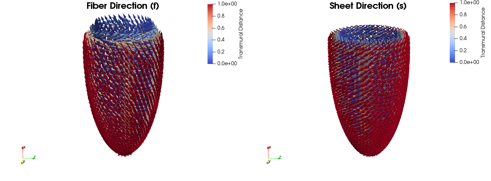
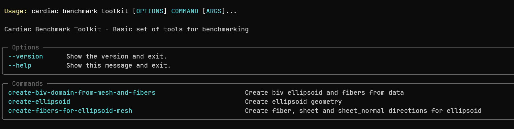
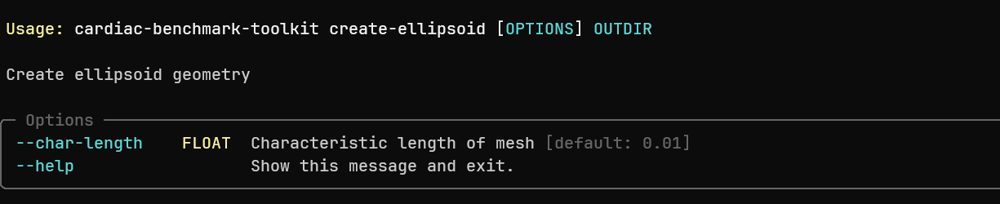
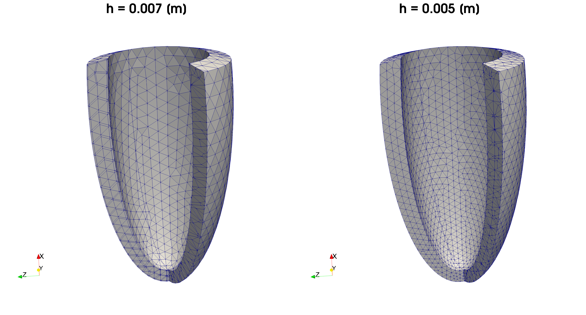
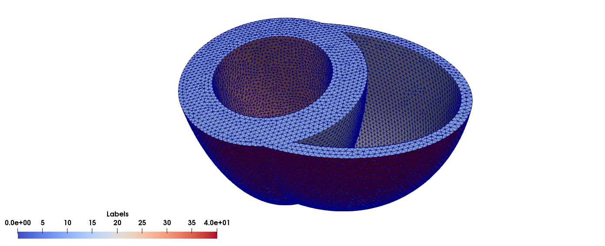
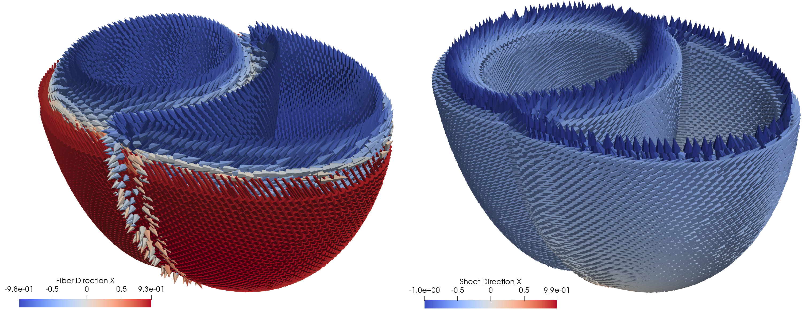

# Cardiac Benchmark Toolkit

This repository contains basic scripts that allow you to reproduce the mesh
as well as the fibers in the cardiac mechanics benchmark in dolfin (legacy). 

*For the [dolfinx](https://github.com/FEniCS/dolfinx) implementation of the tools, [check here](https://github.com/Reidmen/cardiac_benchmark_toolkitx)*



## Installation

**Docker** (Recommended)
Run the following command to start a container with all the required dependencies:

```shell
docker run --name dolfin-stable -v $(pwd):/home/shared -w /home/shared -ti ghcr.io/scientificcomputing/fenics-gmsh:2023-04-21
```

In order to enter the shell, use:

```shell
docker exec -ti dolfin-stable /bin/bash -l
```

**Note** docker image is courtesy of *Simula Lab*.

### Local Installation

If your system has already `fenics` version `2019.1.0.post0`, you can install this package typing:

```shell
pip3 install .
```

## Quickstart

To have an overview of the options available through this package, execute it your terminal

```shell
cardiac-benchmark-toolkit --help
```
It the installation was succesfull you should be prompted with the following:


## Mesh Generation

### Ellipsoid domain
The ellipsoid domain can be created with a characteristic element size (default is `0.005 [m]`) using the
script `mesh_generation.py`. It will create a folder structure `./results` to stores `xdmf` as well as `pvd` formats
for further usage.

To execute it, consider the following command:
```shell
cardiac-benchmark-toolkit create-ellipsoid --char-length 0.007
```

Its command details can be seen with:
```
cardiac-benchmark-toolkit create-ellipsoid --help
```


It will create an ellipsoid mesh with characteristic element size of `0.007 [m]`. You can use it in conjuntion with the
`ellipsoid_fiber_generation` to create the fiber directions for your specific simulation (and benchmark).

Examples of mesh at two different element sizes can be seen below:


### Biventricular domain
The biventricular domain is provided in the `./data/` including source files in `vtk`, `pvd` for fine and coarse sizes.
Example of a fine geometry is depicted below:



### Ellipsoid Fiber Generation
This repository provides a tagged ellipsoid geometry for reference purposes in the folder `./data/monoventricle_mesh/`.
Using the mesh `./monoventricle_mesh/ellipsoid_0.005.xdmf`, you can create the fibers as follows:

```shell
cardiac-benchamrk-toolkit create-fibers-for-ellipsoid-mesh ./monoventricle_mesh/ellipsoid_0.005.xdmf
```

If succesfull, the script will create fibers in `xdmf` and `vtk` files in a `./results/` folder.

Further options can be found with:

```shell
cardiac-benchmark-toolkit create-fibers-for-ellipsoid-mesh --help
```

### Biventricular Fiber Generation (LifeX -> FEniCS)
Reference fibers created using the [lifex](https://bmcbioinformatics.biomedcentral.com/articles/10.1186/s12859-023-05260-w)
can be found in the subfolder in `./data/` as `fiber_biv.vtk`. This repository includes options to
generate FEniCS-compatible `h5` format for fiber directions.

To crate fibers for the fine mesh in P2, run in your shell:
```shell
cardiac-benchmark-toolkit create-biv-domain-from-mesh-and-fibers data/biv_mesh_and_fibers_fine_p2/ --element_degree 2
```

The command line above will create fiber, sheet and sheet-normal directions from the `vtk` source files in `./data/biv_mesh_and_fibers_fine_p2`.

Depicted below are fiber (left) and sheet (right) directions created from this procedure.

